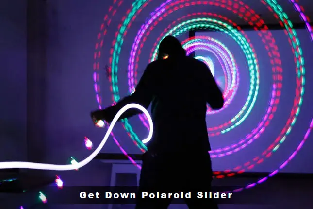
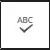

####

# Get Down Polaroid Slider | _Custom Gutenberg Block_

This WordPress plugin adds a lightweight slider block with an option to display your slides as polaroid pictures.
- Each slide has:
	- An image
	- A custom display time
	- A message (optional)
	- An `alt` attrbute (optional)
- Settings available:
	- Display images as polaroid pictures
	- Pause when the user scrolls
	- Pause when the user switches to a different tab

## Table of Contents
- [Video Demo](#video_demo)
- [Live Demos](#live_demos)
- [Installation](#installation)
- [Changelog](#changelog)

## Video Demo<a name="video_demo"></a>

[Watch Video](https://davidpottercodes.com/getdown/wp-content/plugins/getdown/assets/demo.mp4) - In this video **_Get Down Polaroid Slider_** gets downloaded as a cloned repo via git and then installed, configured, and displayed via WP-ENV. Requires: [Linux](https://ubuntu.com/desktop/wsl), [Git](https://git-scm.com/book/en/v2/Getting-Started-Installing-Git), [Docker](https://docs.docker.com/engine/install/ubuntu/), [Node](https://github.com/nvm-sh/nvm?tab=readme-ov-file#installing-and-updating), [WP-ENV](https://developer.wordpress.org/block-editor/reference-guides/packages/packages-env/).


## Live Demos<a name="live_demos"></a>

- `Polaroid Style` [On](https://davidpottercodes.com/getdown/polaroid-style-on/)

- `Polaroid Style` [Off](https://davidpottercodes.com/getdown/polaroid-style-off/)

## Installation<a name="installation"></a>

 [Download](https://github.com/dpotter05/getdown/archive/refs/heads/main.zip) this plugin as a zip file, unzip, rename the folder from _getdown-main_ to _getdown_, zip the folder as _getdown.zip_, and then in your _Plugins_ page click "Upload Plugin" and select _getdown.zip_.

##  Changelog<a name="changelog"></a>

- **`2.0`** Slider's backend is switched from a shortcode to a custom Gutenberg **block** (static).
	- Add this slider to a page as a block. 
	- Add content and configure settings in the block toolbar.
	- The `polaroid-style-width` setting is removed as slide widths in polaroid style are now set with the `aspect-ratio` CSS property.
	- Default slides are now included.
	- The maximum number of slides allowed is now six.
<details><summary>More</summary>

Add this slider to a page as a block.
- Search for "Get Down Polaroid Slider" to find the block.
- The slider's first slide will appear. Click this slide to see the block toolbar.

Add content and configure settings in the block toolbar.
- Click a slide to see the block toolbar. 
- Click the `Configure slider` button  to see the toolbar buttons `Edit slide` , `Change slides` , and `Settings` .
- Click the `Edit slide` button  to change a slide's image, [alt attribute](## "An alt attribute is a hidden image description to improve SEO and accessibility for users with visual impairments."), message, and duration.
- Click the `Change slides` button  to change a slide's position, duplicate a slide, or delete a slide.
- Click the `Settings` button  to toggle these slider settings: `Polaroid style`, `Pause on scroll`, `Pause when viewing another tab`.

</details>

- **`1.0`** Add this slider to page as a **shortcode**.
	- Add content and configure settings via shortcode attributes.
	- Content per slide: image, image description (only visible to screen readers), slide duration, message (optional).
	- Settings: `pause_on_scroll`, `pause_when_viewing_another_tab`, `polaroid_style`, `polaroid_style_width`.
<details><summary>More</summary>

**Shortcode Attributes: Content**

- `image_urls` Add each slide's image URL here via a comma-separated list. Example: _image_urls="https://hi.com/slide1.jpg, https://hi.com/slide2.jpg, https://hi.com/slide3.jpg, https://hi.com/slide4.jpg"_.

- `durations_in_milliseconds` Add each slide's duration in milliseconds here via a comma-separated list. One second equals 1,000 milliseconds. Example: _durations_in_milliseconds="4000, 4000, 4000, 4000"_.

- `messages` Add each slide's message here via a comma-separated list. Messages consisting of "-" will be hidden. In this example no message is shown for the third slide: _messages="DO A LITTLE DANCE, MAKE A LITTLE LOVE, -, GET DOWN TONIGHT"_.

- `image_descriptions` Add each slide's image description (alt attribute) here via comma-separated list. Example: _image_descriptions="Man dancing, DJ performing, Crowd dancing to music, Crowd celebrating"_.

**Shortcode Attributes: Settings**

- `pause_on_scroll` If set to "yes" the slider will pause when the page is scrolled. Example: _pause_on_scroll="yes"_.

- `pause_when_viewing_another_tab` If set to "yes" the slider will pause when the user is viewing another tab. Example: _pause_when_viewing_another_tab="yes"_.

- `polaroid_style` If set to "yes" slides will appear as polaroid photos. Example: _polaroid_style="yes"_.

- `polaroid-style-width` If slides are displayed in polaroid style, specify the width of the slider. Accepts `px`, `rem`, `vw`, `min()`, `max()`, and `clamp()`. Does not accept percentages %. Examples: _polaroid-style-width="450px"_, _polaroid-style-width="50vw"_, _polaroid-style-width="clamp(360px, 50vw, 500px)"_.


**Shortcode examples**

```
[getdown image_urls="https://examplesite.com/wp-content/uploads/2022/04/slide_01.jpg, https://examplesite.com/wp-content/uploads/2022/04/slide_02.jpg, https://examplesite.com/wp-content/uploads/2022/04/slide_03.jpg, https://examplesite.com/wp-content/uploads/2022/04/slide_04.jpg" durations_in_milliseconds="4000, 4000, 4000, 4000"]
```

```
[getdown image_urls="https://example.com/slide1.jpg, https://examplesite.com/slide2.jpg, https://examplesite.com/slide3.jpg, https://examplesite.com/slide4.jpg" durations_in_milliseconds="4000, 4000, 4000, 4000" image_descriptions="Man dancing, DJ performing, Crowd dancing to music, Crowd celebrating" messages="DO A LITTLE DANCE, MAKE A LITTLE LOVE, -, GET DOWN TONIGHT" pause_on_scroll="yes" pause_when_viewing_another_tab="yes" polaroid_style="yes" polaroid-style-width="clamp(360px, 50vw, 500px)"]
```
</details>
